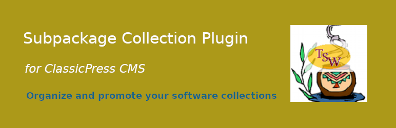

# Subpackage Collection Lister

## Features
- Quickly setup a robust collection of software of non-physical products online.

## Subpackage Collection

Contributors: tradesouthwestgmailcom

Donate link: https://paypal.me/tradesouthwest

Tags: directory, list, software, packages, subpackages

Tested up to: 2.2.0

Requires CP:  1.7.1

License: GPLv3 or later.
License URI: http://www.gnu.org/licenses/gpl-3.0.html

<!-- #057f99 -->
